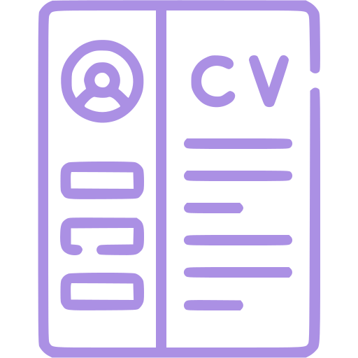
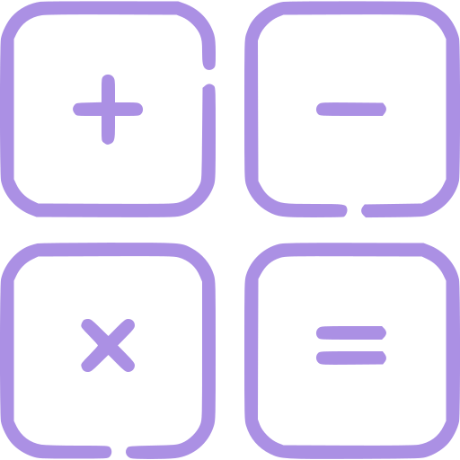
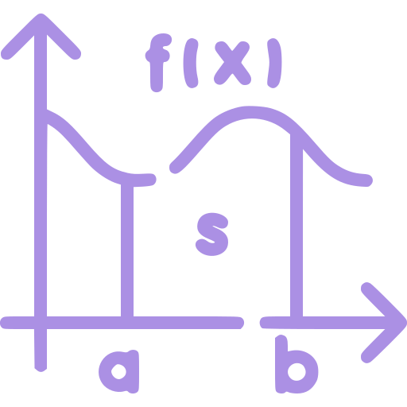
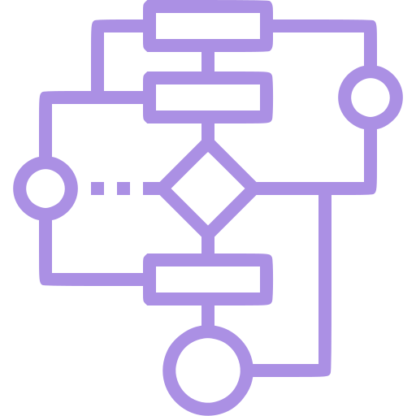
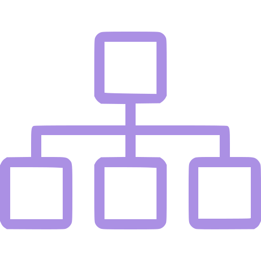
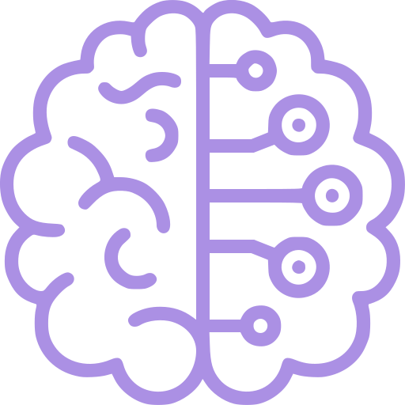
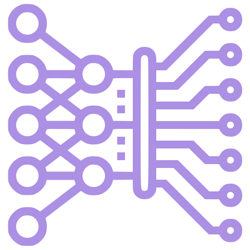
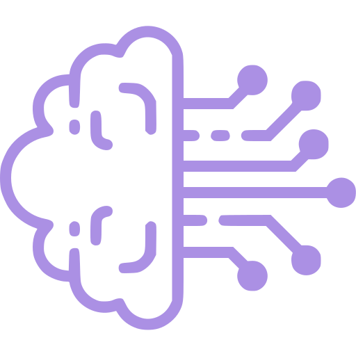

### Hello there 👋
...General kenobi

### Education
|University|Description|
|:----:|:-----|
|HSE| (2023  — 2027) Bachelor of Computer Science|

### My CV's

|Backend|ML|
|:----:|:-----:|
|
<a href="./CV/VlasovArtyom-CV-March-2025-Backend.pdf">
</a>|

|

### 💬 Interests
|||||
|----|----|----|----|----|
|||

- ⚙️ I’m currently working on Project: [Приложении по организации совместных обедов](https://github.com/t-lunch)
- 💡 I’m still learning [Mashing Learning Specialization](https://www.coursera.org/specializations/machine-learning-introduction?action=enroll)
- ⚡ Fun fact: Мой любимый цвет - осенний!
<!--
## Skills, Languages, Frameworks and Stuff
> Click 4 expanding the slider -->

<!--

  
BackEnd

|Prof.|||| |
|:----:|:----:|:----:|:----:|:----:|:----:|
|| ||||| 

|Famil.|||||
|:----:|:----:|:----:|:----:|:----:|:----:|
||||||
||

## IDE's
|||||
|:----:|:----:|:----:|:----:|:----:| -->
<!-- 

  
Data Science

 -->

## 🌐 Languages and Tools 🛠️

### Mashing and Deep Learning:

### Backend:

### Other Tools:

## Natural Languages

||||||||
|:----:|:----:|:----:|:----:|:----:|:----:|:----:|

<!--  -->

 
 
 

  
  

<!--  -->

<!--  -->
